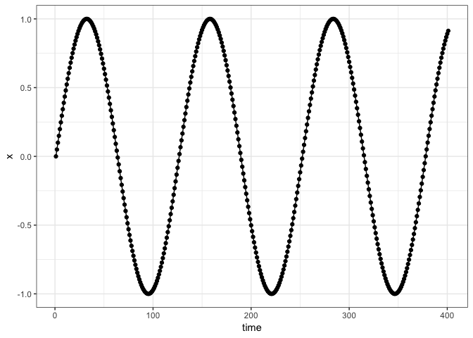
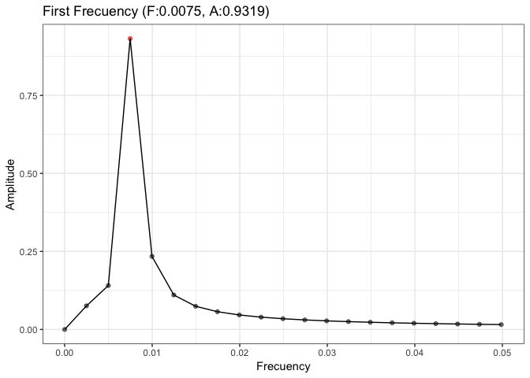
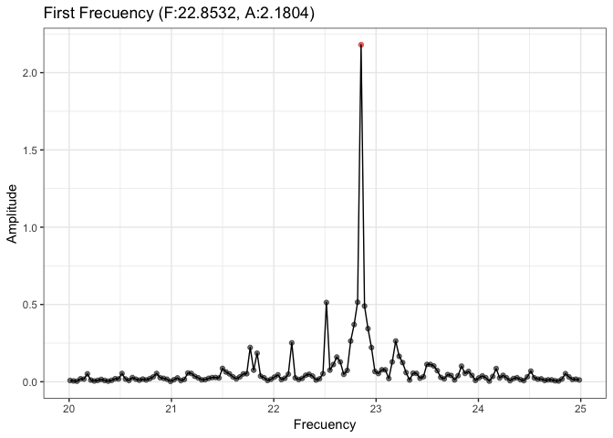

Frequences and amplitudes
================
Roberto Maestre
10/24/2018

Library Introduction
--------------------

Talk about variable stars ... (tbd)

Introduction
------------

The Fourier transform (FT) decomposes a function of time (a signal) into the frequencies that make it up. In Astrophysics, specially in Pulsars study, this technique suposes the main tool to study it patterns, and therefore, clasiffy this kind of stars. The main formula of Discrete Fourier Transform is:

$$ F\_n = \\sum\_{k=0}^{N-1} f\_k \\cdot e^{-2 \\pi \\cdot i \\cdot n \\cdot \\frac{k}{N}}$$

Examples
--------

### 1. Simple signal. Sin.

The first signal is the sin one. This signal is very clear and the period can be calculated visually.

``` r
x <- sin(seq(from = 0,
             to = 20,
             by = 0.05))
# Add secuential times
dt.test <-
  data.frame("time" = seq(from = 1, to = length(x)), "x" = x)
ggplot(aes(time, x), data = dt.test) +
  geom_point() +
  geom_line() +
  theme_bw()
```



We campute the FT, calculating the amplitudes.

``` r
# Compute DFT
dt.spectrum <- calculate_amplitudes(dt.test$time, dt.test$x)
# Get max amplitude
maxAmplitude <- dt.spectrum[which.max(dt.spectrum$amplitude),]
# Plot amplitudes
plot_spectrum(0, 0.05, dt.spectrum)
```



Therefore, the period is $p=\\frac{1}{F}$ = 133.6666667

### 2. A noisy signal example

Another synthetic example, where a more noisy signal is provided is the next one:

``` r
## noisy signal with amplitude modulation
x <- seq(from = 0,
         to = 1,
         length.out = 200)
# original data
y_org <- (1 + sin(2 * 2 * pi * x)) * sin(20 * 2 * pi * x)
# overlay some noise
x <- y_org + rnorm(length(x), sd = 0.2)
# Add secuential times
dt.test <-
  data.frame("time" = seq(from = 1, to = length(x)), "x" = x)
ggplot(aes(time, x), data = dt.test) +
  geom_point() +
  geom_line() +
  theme_bw()
```


We use DFT to calculate the amplitude in each frecuency.

``` r
# Compute DFT
dt.spectrum <- calculate_amplitudes(dt.test$time, dt.test$x)
# Get max amplitude
maxAmplitude <- dt.spectrum[which.max(dt.spectrum$amplitude),]
# Plot amplitudes
plot_spectrum(0, 0.5, dt.spectrum)
```


Therefore, the period is $p=\\frac{1}{F}$ = 10

### 3. Real data from a pulsar star

In this case, we use the photometry of a pulsar star, in which timestamp the magnitude of the pulsar is given. In this case, analize the patter in visually complex.

``` r
# Read pulsar data
dt.pulsar <- data.table(read.csv("../data/pulsar.tsv", sep = "\t"))
ggplot(aes(time, mmag), data = dt.pulsar[sample(nrow(dt.pulsar), 1000),]) +
  geom_point() +
  geom_line() +
  theme_bw()
```


We use DFT to calculate the amplitude in each frecuency.

``` r
# Calculate
dt.spectrum <-
  calculate_amplitudes(dt.pulsar$time, dt.pulsar$mmag)
# Get max amplitude
maxAmplitude <- dt.spectrum[which.max(dt.spectrum$amplitude),]
# Plot amplitudes
plot_spectrum(20, 25, dt.spectrum)
```



Therefore, the period of this pulsar is $p=\\frac{1}{F}$ = 0.0437575.

Benchmark
---------

A benchmark is proposed to show the performance achieved by made all calculations witn C++ and Armadillo (RcppArmadillo). We achieve an average value of 310 ms to compute a DFT on 43372 time values.

``` r
m <-
  microbenchmark(dt <-
                   calculate_amplitudes(dt.pulsar$time, dt.pulsar$mmag),
                 times = 50)
autoplot(m, log = F) +
  scale_x_discrete(labels = c("DFT on a Pulsar star data")) +
  xlab("")
```


