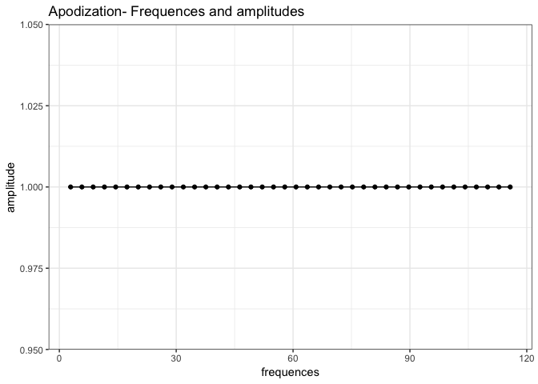
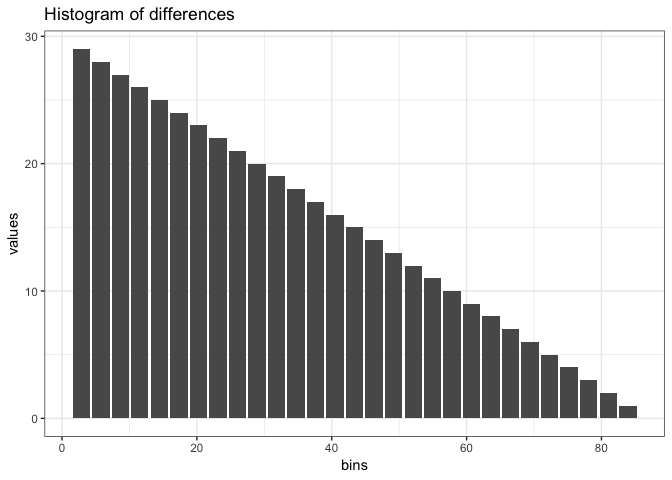

Synthetic Experiment. I
================
Roberto Maestre
12/17/2018

Experiment configuration
------------------------

#### Parameters for execution

``` r
paramters = list(
  "filter" = "uniform",
  "gRegimen" = 0,
  "minDnu" = 15,
  "maxDnu" = 95,
  "dnuValue" = -1,
  "dnuGuessError" = 10,
  "dnuEstimation" = TRUE,
  "numFrequencies" = 30,
  "debug" = TRUE)
```

#### Data source

Choose:

-   dataFlag = T, to use synthetic data generated or,

-   dataFlag = F, to use a real pulsar photometry

``` r
dataFlag = F
```

#### Frequences and Amplitudes on photometry data

``` r
# Generate first pattern
dt.spectrum <- data.frame(
  "frequency" = seq(from=0, to=10, by=0.5),
  "amplitude" = 10
)
# Generate second pattern as the biased first
dt.spectrum.bias <- data.frame(dt.spectrum)
dt.spectrum.bias$frequency <- dt.spectrum.bias$frequency + 0.3
dt.spectrum.bias$amplitude <- 5

# All together
dt.spectrum <- rbind(dt.spectrum, dt.spectrum.bias)

# Get max amplitude
maxAmplitude <- dt.spectrum[which.max(dt.spectrum$amplitude), ]
# Plot amplitudes
plot_spectrum(min(dt.spectrum$frequency),
              max(dt.spectrum$frequency),
              dt.spectrum)
```


``` r
# Save Data to disk (to be replicated)
write.table(
  dt.spectrum[c("frequency", "amplitude")],
  file = "/tmp/data.csv",
  sep = "\t",
  quote = F,
  row.names = F,
  col.names = F
)
```

Experiment execution
--------------------

process is the main method on the variableStars package to compute and estimate all parameters

``` r
result <- process(
  dt.spectrum$frequency,
  dt.spectrum$amplitude,
  filter = "uniform",
  gRegimen = 0,
  minDnu = 15,
  maxDnu = 95,
  dnuValue = -1,
  dnuGuessError = 10,
  dnuEstimation = TRUE,
  numFrequencies = 30,
  debug = TRUE
)
```

    ## ::: Debug information :::
    ## 
    ## Number of frequences to be processed: 42
    ## Number of frequences after drop the g regimen: 41
    ## Frequencies: 5.78704, 11.5741, 17.3611, 23.1481, 28.9352, 34.7222, 40.5093, 46.2963, 52.0833, 57.8704, 63.6574, 69.4444, 75.2315, 81.0185, 86.8056, 92.5926, 98.3796, 104.167, 109.954, 115.741, 
    ## Range: 30, 41, 
    ##  Iteration over range: 30
    ##    Frequencies selected: 5.78704, 11.5741, 17.3611, 23.1481, 28.9352, 34.7222, 40.5093, 46.2963, 52.0833, 57.8704, 
    ##    Amplitudes selected: 10, 10, 10, 10, 10, 10, 10, 10, 10, 10, 
    ##     Dnu: 1.1584
    ##     Dnu Peak: 1.1584
    ##     Dnu Guess: 1.15741
    ##     Cross correlation calculated:
    ##  Iteration over range: 41
    ##    Frequencies selected: 5.78704, 11.5741, 17.3611, 23.1481, 28.9352, 34.7222, 40.5093, 46.2963, 52.0833, 57.8704, 
    ##    Amplitudes selected: 10, 10, 10, 10, 10, 10, 10, 10, 10, 10,

#### Main results

-   **Dnu** (`result$dnu`) = 1.1584.
-   **DnuGuess** `(result$dnuGuess`) = 1.1574074.
-   **DnuPeak** (`result$dnuPeak`) = 1.1584.
-   **Frequency** (`result$photometry$frequency`) = ...
-   **Amplitude** (`result$photometry$amplitude`) = ...
-   **Diffs** (`result$diffHistogram$diffs`) = 5.787037, 11.5740741, 17.3611111, 23.1481481, 28.9351852, 34.7222222, 40.5092593, 46.2962963, 52.0833333, 57.8703704, 63.6574074, 69.4444444, 75.2314815, 81.0185185, 86.8055556, 92.5925926, 98.3796296, 104.1666667, 109.9537037, 2.3148148, 3.4722222, 9.2592593, 15.0462963, 20.8333333, 26.6203704...

#### Apodization

``` r
# Plot frecuency and amplitude
ggplot(
  aes(x = frequences, y = amplitude),
  data = data.frame(
    "frequences" = result$apodization$frequences,
    "amplitude" = result$apodization$amp
  )
) +
  geom_point() +
  geom_line() +
  ggtitle("Apodization- Frequences and amplitudes") +
  theme_bw()
```



#### Periodicities

``` r
# DS to save all data
dt <- setNames(data.frame(matrix(ncol = 3, nrow = 0)), c("fInv", "b", "label"))
# Prepare data
ranges <- names(result$fresAmps)
for(range in ranges){
  dt <- rbind(dt, 
  data.frame("fInv"=result$fresAmps[[as.character(range)]][["fInv"]],
             "b"=result$fresAmps[[as.character(range)]][["b"]],
            "label"=paste(result$fresAmps[[as.character(range)]][["label"]]," freqs")))
}
# Plot frecuency and amplitude
ggplot(aes(x = fInv, y = b, group=label, colour=label), data = dt) +
  #geom_point(alpha=0.2) +
  geom_line(alpha=0.8) +
  ggtitle(expression(paste("Periodicities (",d^-1,")"))) +
  xlab(expression(paste("Periodicities (",mu,"hz)"))) +
  ylab("Amplitude") +
  theme_bw() + 
  scale_color_lancet() +
  xlim(0, 10)
```


#### Histogram fo differences.

We only show bins with &gt;0 values

``` r
dt <- data.frame(result$diffHistogram$histogram)
ggplot(aes(x = bins, y = values), data = dt[dt$values > 0,]) +
  geom_bar(stat = "identity") +
  ggtitle("Histogram of differences") +
  theme_bw()
```



### Autocorrelation

``` r
dt <- data.frame(result$crossCorrelation)

ggplot(aes(x = index, y = autocorre), data = dt) +
  geom_line(stat = "identity") +
  ggtitle("Autocorrelacion (Crosscorrelation)") +
  xlab(expression(paste("Periodicities (",mu,"hz)"))) +
  ylab("Autocorrelation") +
  theme_bw()
```


#### For first all frecuencies

``` r
dt <- data.frame(
  "x" = result$echelle$modDnuStacked,
  "y" = result$echelle$freMas,
  "h" = result$echelle$amplitudes
)
plot_echelle(dt)
```


